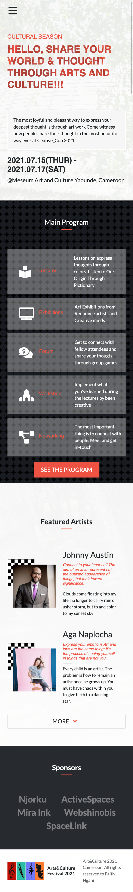
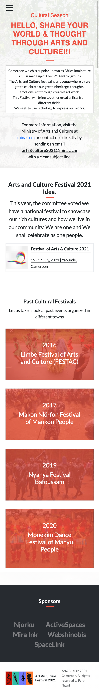

# Summit Page

> Festival of Arts and Culture

## Built with

- HTML
- CSS
- Bootstrap

## Live Demo

[Live Demo Link](https://nganifaith.github.io/conference-page/)

This project is built to carefully outline how Bootstrap and CSS can aid in page layout and responsiveness,
working with this project you will understand and take advantage of grid and flex in both CSS and Bootstrap.

### Prerequisites

- Text Editor
- internet browser

### Setup

- git clone <https://github.com/nganifaith/conference-page.git>
- cd repo-folder
- open in browser

### Install

- No instalation required!

## Author

👤 **Author**

- GitHub: [@nganifaith](https://github.com/nganifaith)
- Twitter: [@Bright_Ngani](https://twitter.com/bright_ngani)
- LinkedIn: [LinkedIn](https://www.linkedin.com/in/ngani-faith/)

**Design idea by**

- Behance: [Mathew Njuguna](https://www.behance.net/mathewnjuguna)

## 📝 License

This project is [MIT](./LICENSE) licensed.
